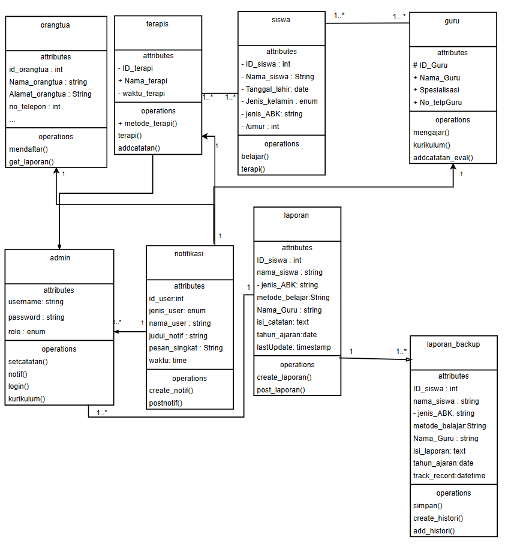

# UTS_Kelompok8_APBO

## Nama Anggota :
1. Abner Boas P. P Gultom	4523210002
2. Andika Haikal S	4523210016
3. Mesak Mychart	4523210062
4. ⁠Khalissa Raihanah	4523210122
5. ⁠Muhammad Al Fatih	4523210135

### Hasil wawancara
[selengkapnya...](WAWANCARA_APBO.pdf)

---
### USE CASE

#### keterangan:
[detail disini...](USE CASE_APBO.pdf)
### ERD_APBO

### CLASS DIAGRAM 

### WIREFRAME_APBO

